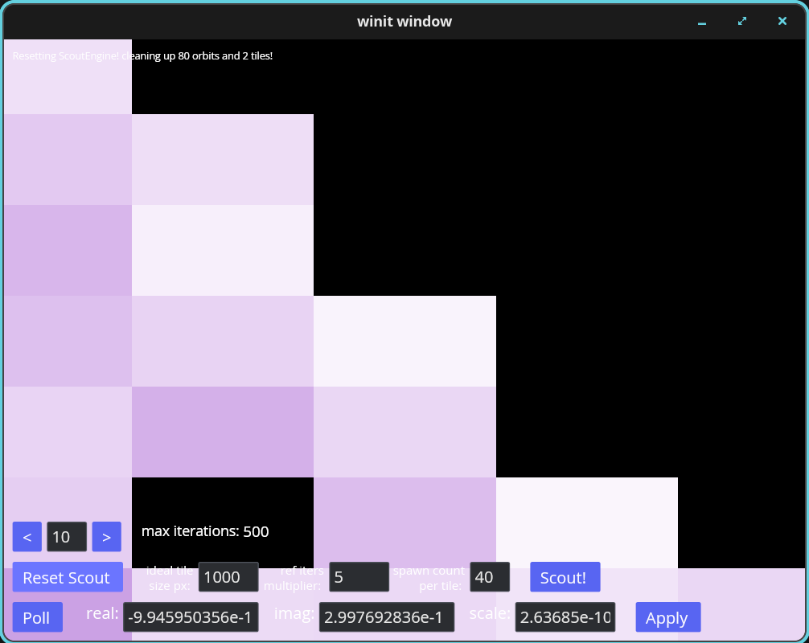
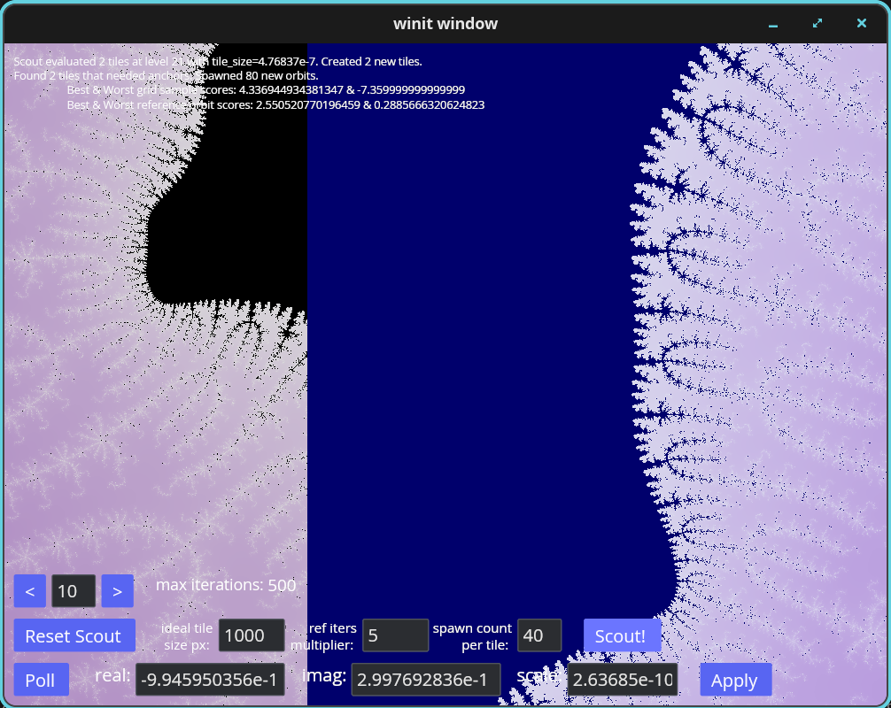

# Mandelbrot Scout
Renders the Mandelbrot Set on the GPU using Rusts's WGPU library. Leverages perturbation theory to overcome the GPU's float 32 precision limitation, and instead seeking to resolve qualified reference orbits that are computed on the CPU.  

The state of the repo is still VERY much a work-in-progress, as I make headway on the 'ScoutEngine' concept for CPU reference orbit discovery, computation, and utilization by the GPU-resident perturbance algorithm. 

I always try to keep HEAD of the repo tested and running, even if/when experimental features are still being developed.

## To compile:
$> cargo build

## To build and run:
$> cargo run

**If you don't have Rust on your system yet, it is very easy to install! Simply download the rustup shell script from [rust-lang.org](https://rust-lang.org/tools/install/), install rust, and then run `cargo run` from the shell once inside the project directory (where Cargo.toml is located). Cargo downloads and builds all the library dependencies, then the project, and then runs! Rust is also very portable, and works perfectly fine, right on Windows! While the shell script installer is meant for posix systems, the Rust community reccomends Chocolaty**

## Background
This project started out with my desire to learn more about OpenGL and how shaders work. As a lover of fractals, I had come across lots of articles that mentioned how the beautifully simple Mandelbrot algorithm can be parallelized. Ideally, each pixel - which can be mapped to a logical coordinate on the complex plane - can calculate its corresponding orbit - i.e. iteration steps until the coordinate escapes with a magnitude greater than 2 - as a completely independent operation. The only info that's needed is the number of iterations until escape, which is then used to compute a color. Well, what better way to compute colors per pixel than on a GPU, whose hardware was built for such a purpose? While some examples of rendering a fractal this way were around when I began looking (I started this in 2017, lol), they were all using GLSL and interfaced with OpenGl through C/C++. I wanted to use Rust though, and thought this could be a great way to learn that language, along with some newer graphics libraries that were making their way into the (at the time VERY new) Rust ecosystem.

A tremendous amount has changed, of course, since I started this, and Rust is making its way onto the scene in a big way, especially for game development and 3d graphics applications. When I switched to the Iced GUI library, I wasn't so sure it would last, but that seemed to be a good decision, and it was one of the few graphics libraries where I could find examples where I could overlay UI widgets on top of a GL canvas - like inside a video game. The Iced project ended up doing far more for me than just UI though. As I continued to search for ways to zoom deeper into the fractal, I came to understand both the benefits, and unfortunatly also the limitations, of WGPU and WGSL. My limitations with WGSL however are not unique, I later discovered, as there really is no such thing as a shader language that runs on the GPU with strong support for double precision. Still, despite this shortcomming, the GPU remains hand's down the best choice for Mandelbrot computation - and at least for the 'dumb' algorithm (i.e. absolute escape of `Zn=Zn^2+C`), is 'embarrassingly parallel'.

# Project Goals
1. Perturbation theory & Series Approximation for deep zooms [Wikipedia](https://en.wikipedia.org/wiki/Plotting_algorithms_for_the_Mandelbrot_set#Perturbation_theory_and_series_approximation)
2. Ever increasing robustness and tuning for CPU-resident ScoutEngine, which finds and computes high-precision reference orbits for the scene/viewport!
3. UI controls for ScoutEngine behavior
4. Coloring algorithms that leverage distance approximation 
5. UI-driven color palate selection 
6. Julia sets & cubic Mandelbrot 

I've been iterating with ChatGPT on the 'Scout Engine' concept for a while now, and sometimes, if I am being honest, I wonder what the heck I was thinking to trust the AI to help me with design. It took me down some frightenting over-enginering paths - and this probably happened because of my own lack of understanding of perturbance - which created a hot-soup of complexity that I should have questened earlier on. That being said, it does and still can help me to better understand the math theory, and that is probably where I needed the most help anyways.

For anyone who has studied the ideas and concepts of Perturbation Theory for the Mandelbrot Set, the problem is non-trivial. Ultimately, it comes down to computing and then providing a very high precision reference orbit, i.e. a vector of complex numbers that represent Z-0 to Z-n, which can then be used for subsequent mandelbrot iterations, for 'nearby' pixels. I quote 'nearby' here very specifically, because even if two complex C for the fractal *are* close-by on the complex plane, that doesn't necessarily mean the reference orbit will be good!

Where I have most decidedly spent the most time - and where ChatGPT has plagued me - is "where" ecactly to spawn the reference orbit. This is where I probably should have spent more time studying how others approached this problem, rather than just blindly trusting the AI, but 'live and learn', I suppose. With that being said however, and with my biggest design goal to keep the render running FAST and responsive to the user, I needed an expediant way to both *find* and *spawn* a 'good enough' reference orbit that can be used for perturbation. 

My most recent re-factor of ScoutEngine now uses GPU feedback that has been reduced from a compute shader to help find 'good' reference orbits. My thought was: The GPU is already computing per-pixel escape during absolute, so why NOT use that as a hint to spawn seeds? While I have now taken a look at a few other approaches that use Newton's method, I still think there is merit to starting the search with some GPU hints. The GPU does, after all, bring massive parallelism to the table, and can potentially allow 1000+ GPU cores to calculate escape. And from what I've seen so far, having a reference that can go at least say 1.5-2x past the iterations of perturbed pixels. then looking where the GPU says the current counts are highest has a good chance of working.

Now that I have seen perturbation actually WORKING in my program, I know that I can simplify ScoutEngine's design even further. Currently, I have a Texture2D which allows up to 64 orbits to be pushed to the GPU, but from what I have seen after some quality orbits were spawned and pushed, it's highly unlikely that the viewport window would need more than two or three. Currently I am using "Complex Tiles" to bucket reference orbits, and those are probably not necessary, and a more straight-forward approach might be for the fragment shader to 'rebase' or fallback to a secondary orbit when a glitch has been found.

At the moment, I also have some handy buttons to start and stop the Engine, which will spawn a reference from GPU grid samples. Camera movement after that breaks though, which happens because of the "misalignment" in complex space, and from the overall control loop of selecting an orbit from low-precision computed escape, recomputing a slightly different position in MPFR high-precision (I configure 128 bits for now), and then sending that orbit back to the GPU in rounded low-precision again - along with a CPU calculated then converted 'delta from viewport center to reference orbit'. 

Absolute rendering still works beautifully though, and is super-fast, and I try to preserve that functionality as I continue to work on perturbation. 

# Screenshots
Here a few recent ones that demonstrate what happens at the precision wall, and then where I am so far with Scout's reference orbit creation.

What happens when you zoom too far on the GPU!

Note, even with my 'Double Float' values (i.e. 2x f32 rounded hi + residual lo), it does not push the zoom boundary much further than GPU native f32.

Now, with those exact same coordinates, after pressing the "Scout!" button...

Note that I have a tile coloring diagnostic in the shader, and that's why the interior looks blue! Tiles are misaligned not only because they are using different reference orbits, but because of the different 'rounding' paths the two orbits took as the seed was 'round-tripped' from low to high, and then back to low precision.

Here is some craziness that ChatGPT was having me do, hunting for an orbit with a perfect 'r_valid' for linerized perturbation (which is NOT necessary when you keep the quadratic term).

Here is my oldest screenshot, where I initially had sliders to control RGB based on a sign wave, and then modulating the frequency of the wave, relative to escape time.

### Other citations and tributes:
Here are the examples/tutorials I followed to help me get started:

https://github.com/iced-rs/iced/tree/0.14.0/examples/integration

NOTE: As with all examples in Git, make sure to view the correct code that has been tagged with the correct release of Iced. Also note, Iced seems to be good at keeping breaking changes from occurring within incremental releases; i.e. all iced_* libs in the 0.14.x series should be compatible. Using a newer version of wgpu might be possible, but only if its API updates are compatible with iced_wgpu; so it's probably not a good idea.

https://sotrh.github.io/learn-wgpu/#what-is-wgpu

Happy fractaling and happy coding!