# Mandelbrot Scout
Renders the Mandelbrot Set on the GPU using Rusts's WGPU library and WGSL shaders, and Iced as the GUI overlay. Leverages perturbation theory to overcome the GPU's float 32 precision limitation, and instead discovers qualified reference orbits 'in the neighborhood', which are computed on the CPU in high precision.  

The state of the repo is still VERY much a work-in-progress, especially for perturbation on the GPU. That being said, I have made some very good progress, and can see quite visibly the drastic difference perturbation makes to overcome the GPU's precision wall! See in the screenshots section below!  

I always try to keep HEAD of the repo tested and running, even if/when experimental features are still being developed. As a stickler for quality UX, I will likely always remain hesitant to label 'official' releases on a regular basis, and likes lots of people writing fractal programs, this is very much a 'hobby project'.

## To compile:
`$> cargo build`

## To build and run:
`$> cargo run`

**If you don't have Rust on your system yet, it is very easy to install! Simply download the rustup shell script from [rust-lang.org](https://rust-lang.org/tools/install/), install rust, and then run `cargo run` from the shell once inside the project directory (where Cargo.toml is located). Cargo downloads and builds all the library dependencies, then the project, and then runs! Rust is also very portable, and works perfectly fine, right on Windows! While the shell script installer is meant for posix systems, the Rust community recommends Chocolaty.**

I'll also include here a special note about Rug, which I am using for MPFR and MPC. As a Linux user, I already had the GNU gcc toolchain installed on my PC (and rustup/cargo will take care of this for you on Linux/MacOS), but on Windows, this requires msys/mingw. Iced and WGPU both seek to be platform independent however, and I am not forcing any render back-end, or using any experimental GL shader features. On MacOC, Metal will likely be used, and on Windows, it will most likely be DirectX-12. Environment variables CAN be used to force a render back-end. 

UPDATE (03/09/2026):
As of yet, I am currently unable to make a Windows build. While I still think it's possible, the problem I ran into is essentially a 'conflict' in dependencies. Because of Rug & MPFR, the mingw compiler needs to be used, and Rug/MFPR's instructions for this point to the installation of the msys terminal - which is essentially a cygwin derivative. Iced & WGPU do NOT like this, however, as cargo then thinks its building on linux, and then starts grabbing X11/Wayland dependencies, rather than Windows Libraries. I had, years ago before I integrated high-precision complex numbers, the program working and running on Windows just fine, and as a test, I compiled one of Iced's UI examples, and that ran on Windows just fine, so it absolutely DOES remain cross-platform! The solution here is likely to pre-compile Rug and then tweak cargo.toml to use that pre-compiled library/dll. Not sure when I will get around to trying this again, as I am not a Windows user. Another solution for windows may be to try Windows subsystem for Linux, though.. that route might present it's own difficulties, as this is a GPU intensive application, and absolutely must open a GUI window, in order to run.

## Background
This project started out with my desire to learn more about OpenGL and how shaders work. As a lover of fractals, I had come across lots of articles that mentioned how the beautifully simple Mandelbrot algorithm can be parallelized. Ideally, each pixel - which can be mapped to a logical coordinate on the complex plane - can calculate its corresponding orbit - i.e. iteration steps until the coordinate escapes with a magnitude greater than 2 - as a completely independent operation. The only info that's needed is the number of iterations until escape, which is then used to compute a color. Well, what better way to compute colors per pixel than on a GPU, whose hardware was built for such a purpose? While some examples of rendering a fractal this way were around when I began looking (I started this in 2017, lol), they were all using GLSL and interfaced with OpenGl through C/C++. I wanted to use Rust though, and thought this could be a great way to learn that language, along with some newer graphics libraries that were making their way into the (at the time VERY new) Rust ecosystem.

A tremendous amount has changed, of course, since I started this, and Rust is making its way onto the scene in a big way, especially for game development and 3d graphics applications. When I switched to the Iced GUI library, I wasn't so sure it would last, but that seemed to be a good decision, and it was one of the few graphics libraries where I could find examples where I could overlay UI widgets on top of a GL canvas - like inside a video game. The Iced project ended up doing far more for me than just UI though. As I continued to search for ways to zoom deeper into the fractal, I came to understand both the benefits, and unfortunately also the limitations, of WGPU and WGSL. My limitations with WGSL however are not unique, I later discovered, as there really is no such thing as a shader language that runs on the GPU with strong support for double precision. Still, despite this shortcomming, the GPU remains hand's down the best choice for Mandelbrot computation - and at least for the 'dumb' algorithm (i.e. absolute escape of `Zn=Zn^2+C`), is 'embarrassingly parallel'. Having the fragment shader handle escape-time iteration means that each pixel 'ideally' gets its own core! And with modern GPUs now having 10,000+ cores, that is far *far* more than the CPU will ever have!

That being said, my foremost goal with the project has always been: Make it fast! If I am not rendering the fractal in at least 25fps, then that's a fail! My aim is *always* to keep the UI super-fast and responsive (as long as you have a 'decent' graphics card), and not waiting for minutes (or hours even) for the fractal to render the viewport! Keeping that speed however, even with a powerful GPU, *does* start to become a serious challenge however, for even modest zooms, and when the iteration count must go higher. 

# Project Goals
1. Perturbation theory & Series Approximation for deep zooms [Wikipedia](https://en.wikipedia.org/wiki/Plotting_algorithms_for_the_Mandelbrot_set#Perturbation_theory_and_series_approximation)
2. Ever increasing robustness and tuning for CPU-resident ScoutEngine, which finds and computes high-precision reference orbits for the scene/viewport!
3. UI controls for ScoutEngine behavior
4. Coloring algorithms that leverage distance approximation 
5. UI-driven color palate selection 
6. Julia sets & cubic Mandelbrot 

I've been iterating with ChatGPT on the 'Scout Engine' concept for a while now, and sometimes, if I am being honest, I wonder what the heck I was thinking to trust the AI to help me with design. It took me down some frightenting over-enginering paths - and this probably happened because of my own lack of understanding of perturbance - which created a hot-soup of complexity that I should have questened earlier on. That being said, it did help me understand the math better, and was useful for pouring through 10,000+ line log output.

For anyone who has studied the ideas and concepts of Perturbation Theory for the Mandelbrot Set, while the idea is simple, the solution is non-trivial. Fundamentally, it comes down to computing and providing a high precision reference orbit, i.e. a vector of complex numbers that represent Z-0 to Z-n, which can then be used for subsequent mandelbrot iterations, for 'nearby' pixels. I quote 'nearby' here very specifically, because even if two complex C for the fractal *are* close-by on the complex plane, that doesn't necessarily mean the reference orbit will be good!

Where I have most decidedly spent the most time - and where ChatGPT has plagued me - is "where" ecactly to spawn the reference orbit. This is where I probably should have spent more time studying how others approached this problem, rather than just blindly trusting the AI, but 'live and learn', I suppose. With that being said however, and with my biggest design goal to keep the render running FAST and responsive to the user, I needed an expediant way to both *find* and *spawn* a 'good enough' reference orbit that can be used for perturbation. Only after some trial and error did I discover that you CAN start with a reference in the Period-1 main cardoid, and render the *entire* set from that single reference! Don't expect deep zoom to be supported with an orbit so far from pixels, but shockingly (at least it was shocking to me!), it *does* work! 

My most recent re-factor of ScoutEngine now uses GPU feedback that has been reduced from a compute shader to help find 'good' reference orbits. My thought was: The GPU is already computing per-pixel escape during absolute, so why NOT use that as a hint to spawn seeds that have a high chance of being in the Set? While I have now taken a look at a few other approaches that use Newton's method, I still think there is merit to starting the search with some GPU hints (about it's per-pixel escape time calculations). The GPU does, after all, bring massive parallelism to the table, and can potentially allow 1000+ GPU cores to calculate escape. And from what I've seen so far, having a reference that can go at least say 1.5-2x past the iterations of perturbed pixels, then spawning a reference where the GPU indicates, works pretty well! And it's fast!

# User Manual
While the GUI is still being heavily worked-on - and is highly subject to change. As such, this might not be the most up-to-date, as I push changes.
1) Iteration Controls
   1) Max User (GPU) iters is now controlled by a slider
   2) There are text boxes now to change the step-size of the slider, and it's min/max range.
2) Color Controls
   1) Color Palette PickList
      1) Choose a color palette to use
      2) Color palettes are loaded from the disk! All palettes (along with other program settings) are in settings/settings.toml
         1) New palettes can be added without re-compile!
   2) Frequency slider
      1) The min/max values of this slider are bounded by settings in settings.toml, and are specific to the palette being used.
      2) A frequency of 1.0 means that, if say, the fractal has 500 iterations, then these will be "stretched" across the palette. The palette length is NOT the size of 'array' in the Palette struct, however, as the GPU is given a fixed-size Texture that is sized according to 'settings.max_palette_colors', which is NOT hardcoded, and can be changed in settings.toml. Be aware however that this is controlling GPU texture allocation, and will be bounded by the capabilities of your graphics card (which is usually either 8192 or 16535). Also note that Palette.array is REPEATED across the texture, which provides the smoother gradients. If you want the palette color sampling to be even 'smoother', then a longer palette should be used (rather than my current default, which is a dinky little RGB array of 3 that is repeated over and over!). 
   3) Offset slider
      1) Shift fractal iterations across the color palette. This value is always bounded between 0-1, 0 is the beginning, 1 is the end. Again note, the palette length is max_palette_colors, NOT the length of the palette array.
   4) Gamma slider
      3) Allows for non-liner interpolation of color. In the shader, this is essentially `t = pow(t, gamma)`. For a power-of-two fractal like the Mandelbrot, a good value to use is 2 - but ranges in-between also look nice!
3) Scout Controls
   1) "Reset Scout" button will delete from program memory all reference orbits, and stop perturbation mode
      1) i.e. Absolute iteration will resume, with no reference orbit being used.
   2) Reference Iters Multiplier
      1) For the calculation of reference orbits, the max iterations used by the GPU will be multiplied using this value. Pertubation prefers orbits 'at least' as long as user/pixel max, but is better that it goes a little further. It also helps for reference orbit qualification, so this way the Scout can rank 'deeper' orbits before supplying them to the GPU.
   3) Spawn Count per Evaluation
      1) ScoutEngine uses 'evaluation cycles' to evaluate reference orbits. This value represents the number of reference orbits it will span from GPU-supplied seed values. If there are at least 'some' pixels 'in the set', then the reduce/compute shader will find then, and the Scout will seed from the translated coordinates. If the viewport is in filaments, then this value should be set higher, as it could take more cycles to find a good reference orbit that has the highest escape.
   4) Max Reference Orbits
      1) The maximum number of Reference Orbits the Scout will 'qualify' - i.e. send to the GPU for perturbing. 
   5) "Scout!" button will start the engine, entering perturbance render mode!
      1) At the moment, pertubation is a 'manual' process. However, the Scout was initially designed for automated orbit discovery, no matter where the user viewport window is located! Still, I think there may be a permanent use-case for running the Scout manually, and only launching evaluation cycles when clicking this button. As Reference Orbit computation is expensive, if the user hasn't noticed artifacts yet, then they may desire to keep the reference, rather than having the engine 'fight' with them anytime they pan/zoom the viewport camera. The user can also decide when/if they want to 'mine' the area for a bit longer, hunting for a better reference orbit that can allow them to pan/zoom with better clarity. This is also when it's worth increasing the 'Ref Iters Multiplier', as the deeper the orbit you can find in the area, the better! This makes orbit-finding a fully interactive process, and you can instantly see the visual difference when a better orbit is found/chosen/used! Also, a helpful diagnostics message will display in the top-left corner of the screen, informing the user of the Scout's activity!
4) Coordinate/Scale Controls
   1) "Poll" button will poll the GPU for its current viewport center and scale.
      1) When this button is clicked, then the three text-boxes for real, imaginary, and scale will populate. The user is then free to enter values of their choosing here, or 'save them' - i.e. by clicking the "Apply" button after moving the viewport, which will reset the GPU back to saved coordinates. Note the user CAN enter values into the text-boxes when/if they are empty, and then click apply - i.e. if you copy-paste some well-known coordinates from an internet source!
   2) Enter the Real complex coordinate for desired viewport center
   3) Enter the Imaginary complex coordinate for the desired viewport center
   4) Enter the desired viewport scale. 
   5) "Apply" button will take the values in the three text-boxes, and apply them to the GPU.
      1) Note that either scientific notation or decimal notation can be used inside these boxes. String validation of these values does not occur until the Apply button is clicked. 

## Helpful environment variables to use on CLI while running
Having settings.toml is now a hard requirement for the program to run! I essentially removed all my hard-coded defaults, and put them in here! Eventually, I will also have hard-coded fallbacks, but for now, it's easy to make sure this file exists when the program runs. By default, the program looks for this file in `$cwd/settings/settings.toml`, were `$cwd` is the current working directory (and when using `cargo run` at project root, there is nothing more to be done). If you want to change its location, use the SETTINGS_DIR environment variable.

The RUST_LOG environment variable controls all the logging output, which is essential for debugging. Also, many other library dependencies (critically, WGPU) use the Rust logger, so this turns into the most essential environment variable for debugging!

Here are a few presets that I often use:

`$> export RUST_LOG=mandelbrot=trace` - This writes complete debug info for my program to STDERR.

`$> export RUST_LOG=wgpu_core=trace` - If you are having problems running the program - i.e. the window isn't opening, or it can't find your graphics card or a render back-end, use this!

`$> export RUST_LOG=mandelbrot::scout_engine=trace` - If you want to take a look at how the Scout is choosing reference orbits for the active viewport window!

`$> export WGPU_BACKEND=vulkan` - Force a render-backend. Valid strings are: `vulkan`, `metal`, `dx12`, or `gl`.
If you want to know more about what WGPU can support, look [here](https://github.com/gfx-rs/wgpu)

# Basic Use
I made this GIF to show how easy this program is to use!

# Screenshots
Here a few recent ones that demonstrate what happens at the precision wall, and then where I am so far with Scout's reference orbit creation.

What happens when you zoom too far on the GPU!
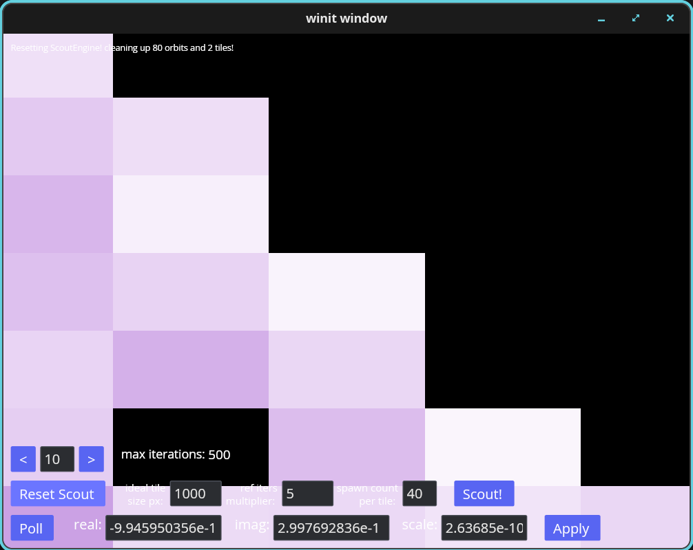
Note, even with my 'Double Float' values (i.e. 2x f32 rounded hi + residual lo), it does not push the zoom boundary much further than GPU native f32.

Now, with those exact same coordinates, after pressing the "Scout!" button...
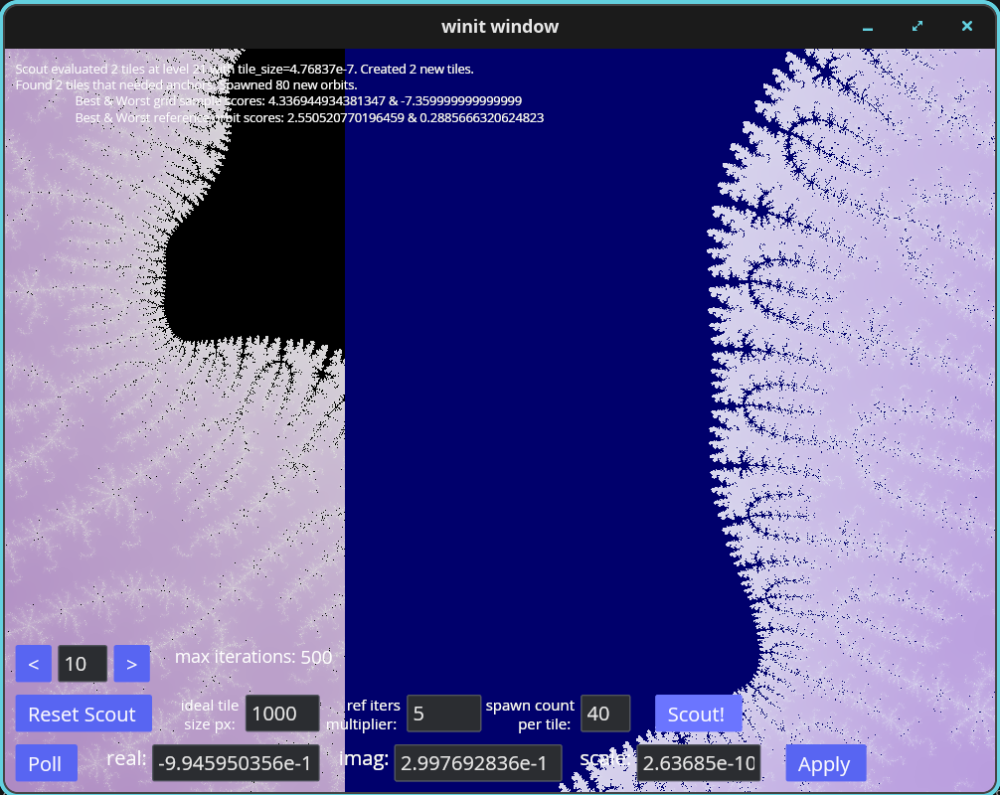
Note that I have a tile coloring diagnostic in the shader, and that's why the interior looks blue! Tiles are misaligned because they are using two different reference orbits. NOTE, I am NO LONGER USING TILES! Better to just have one good reference orbit, and then rebase with a secondary orbit, but ONLY for pixels that glitched.

Here is some craziness that ChatGPT was having me do, hunting for an orbit with a perfect 'r_valid' for linerized perturbation (which is NOT necessary when you keep the quadratic term).
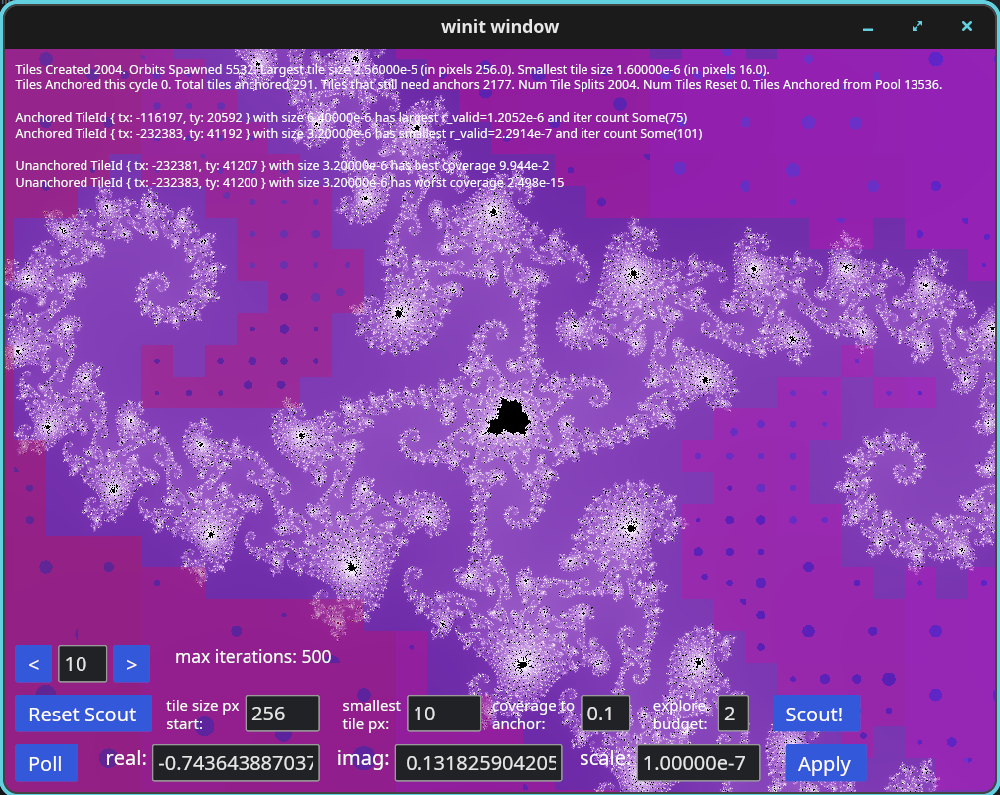

Here are a few more 'before and after pertubation snapshots, to show how much it shifts the precision wall!
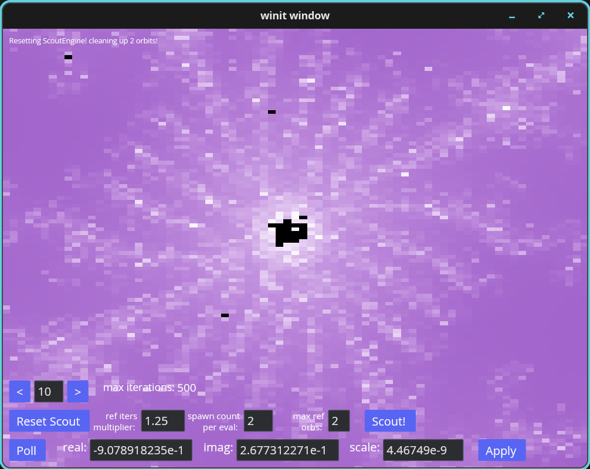
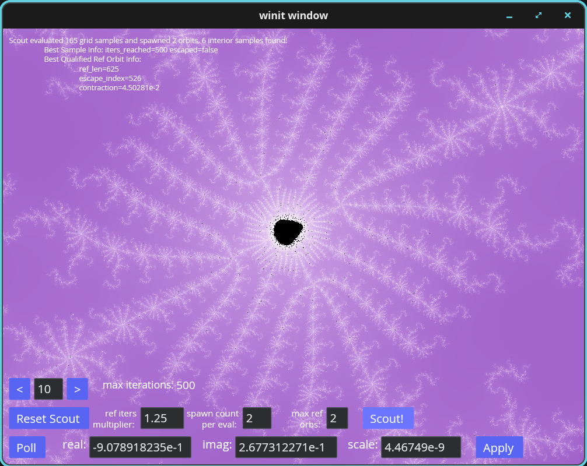
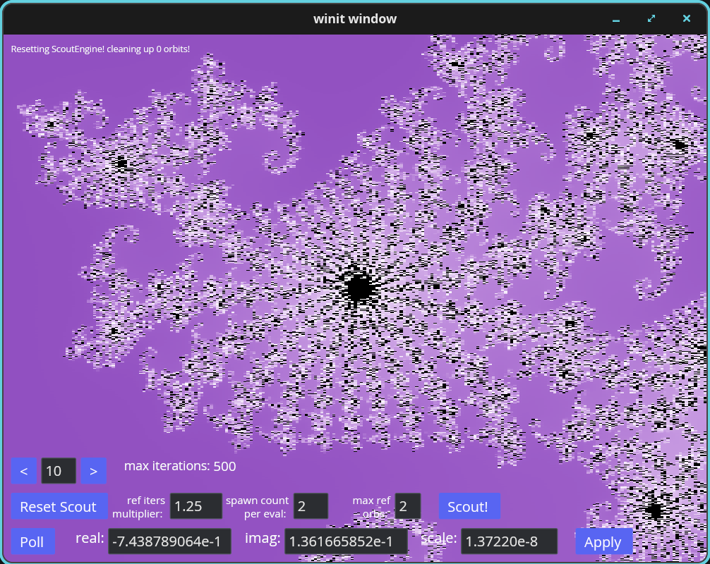
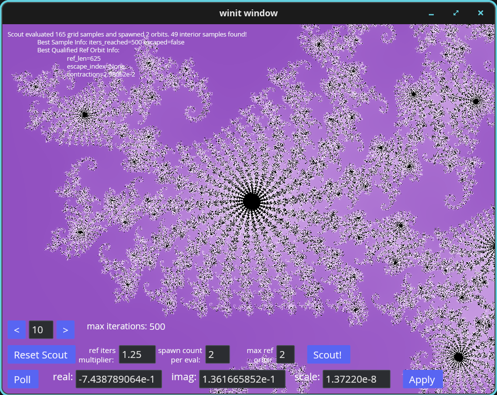

A few more nice ones that I have been able to make at zoom past typical GPU shader support!
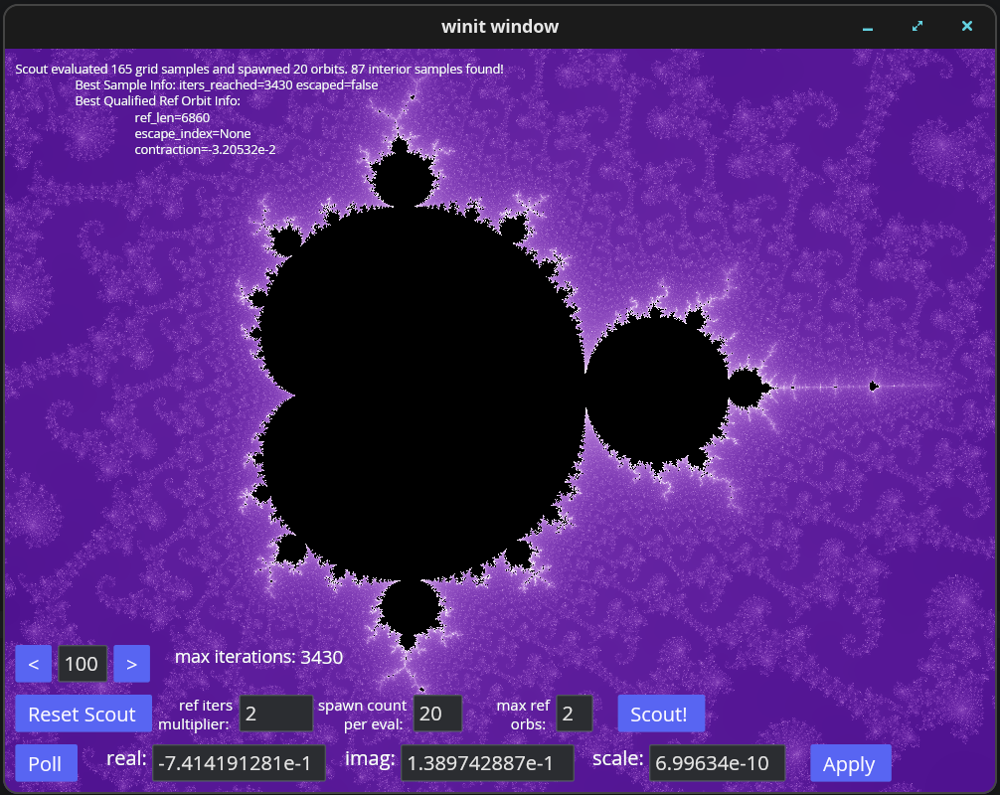
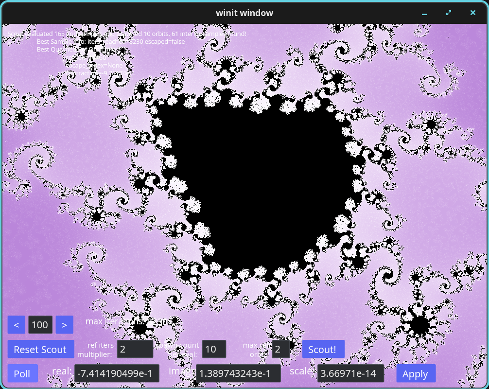

Some preliminary deep-zoom tests...
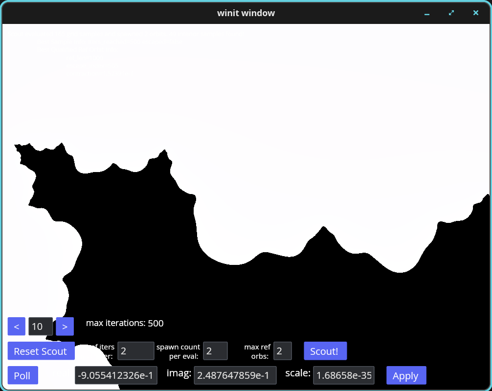
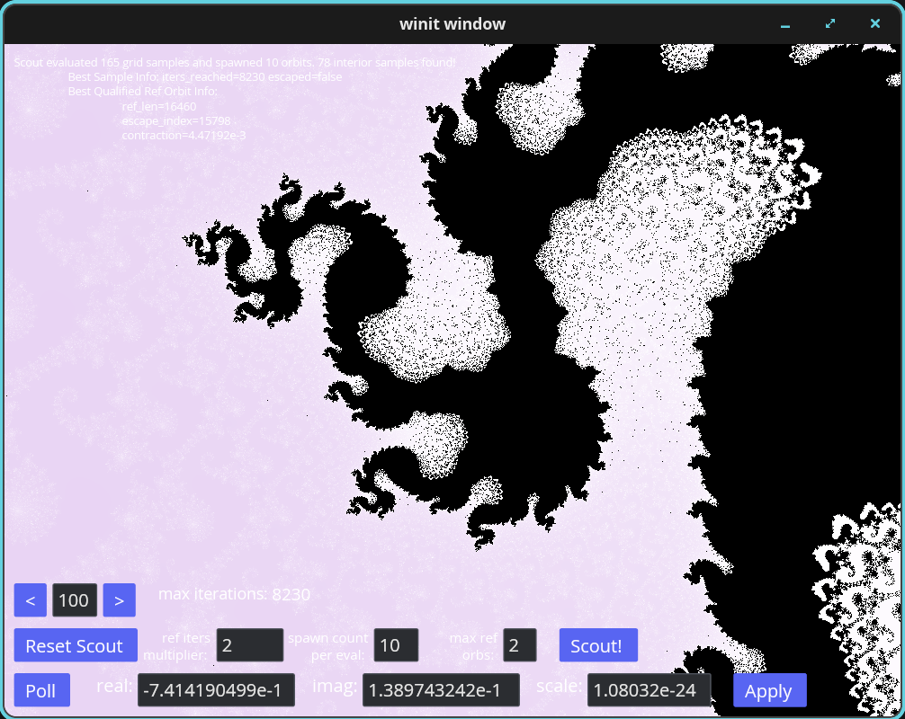
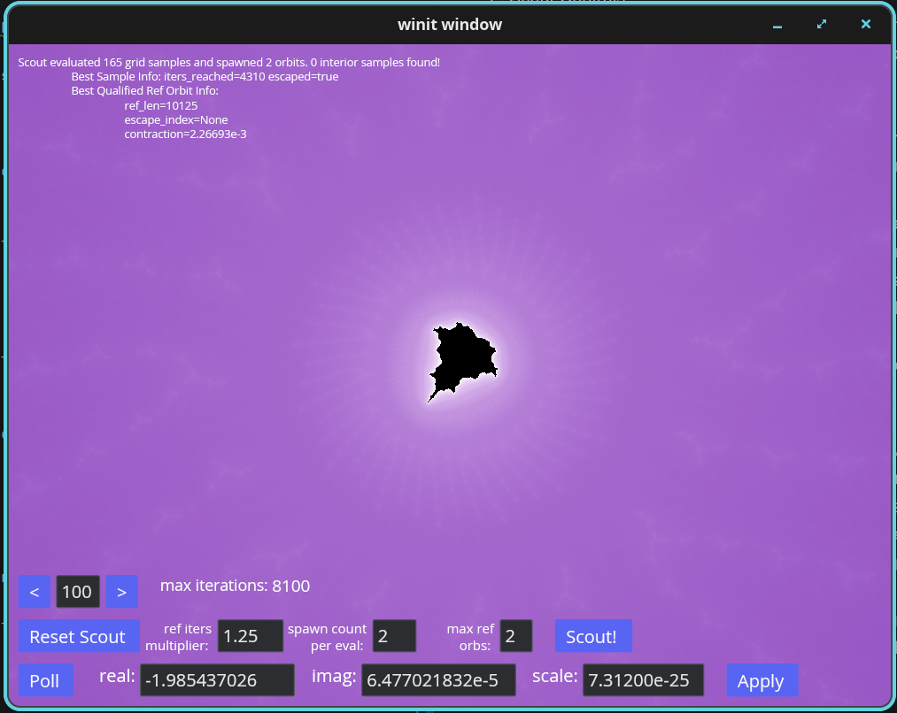

Here is my oldest screenshot, where I initially had sliders to control RGB based on a sign wave, and then modulating the frequency of the wave, relative to escape time.

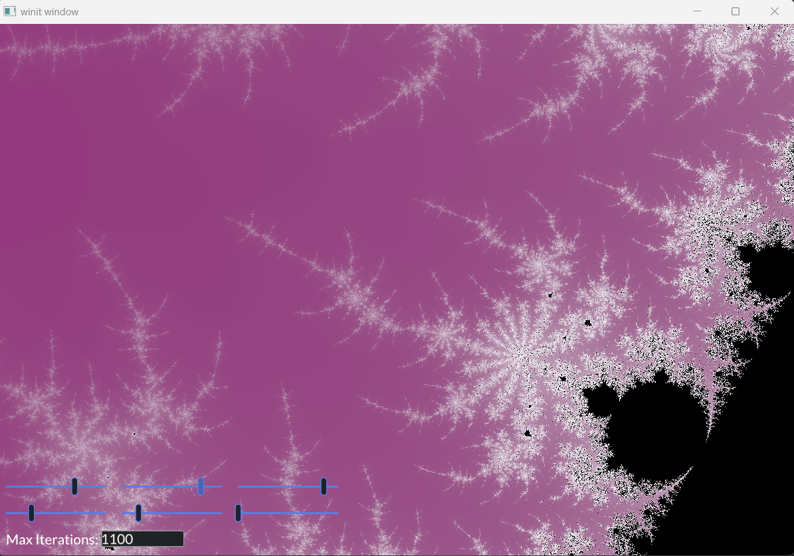

### Other citations and tributes:
Here are the examples/tutorials I followed to help me get started:

https://github.com/iced-rs/iced/tree/0.14.0/examples/integration

NOTE: As with all examples in Git, make sure to view the correct code that has been tagged with the correct release of Iced. Also note, Iced seems to be good at keeping breaking changes from occurring within incremental releases; i.e. all iced_* libs in the 0.14.x series should be compatible. Using a newer version of wgpu might be possible, but only if its API updates are compatible with iced_wgpu; so it's probably not a good idea.

https://sotrh.github.io/learn-wgpu/#what-is-wgpu

Happy fractaling and happy coding!